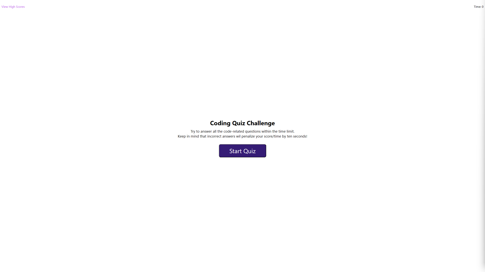
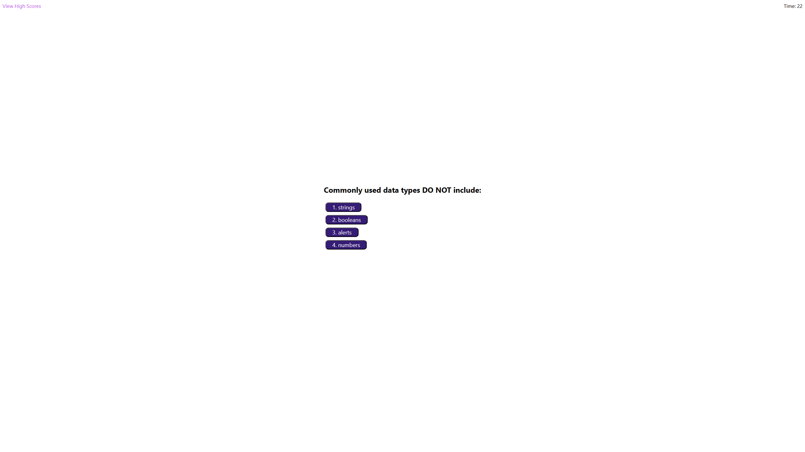
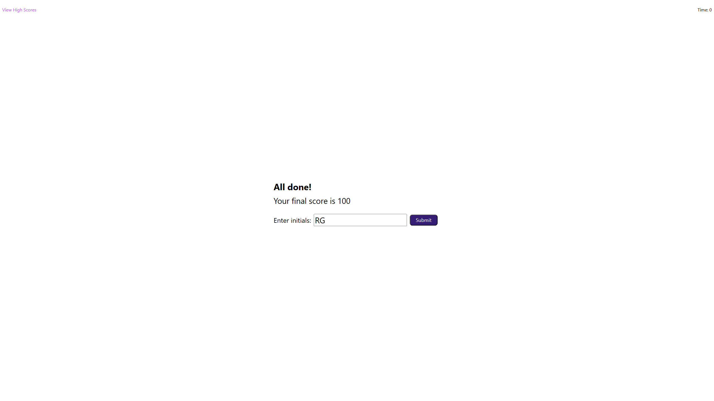
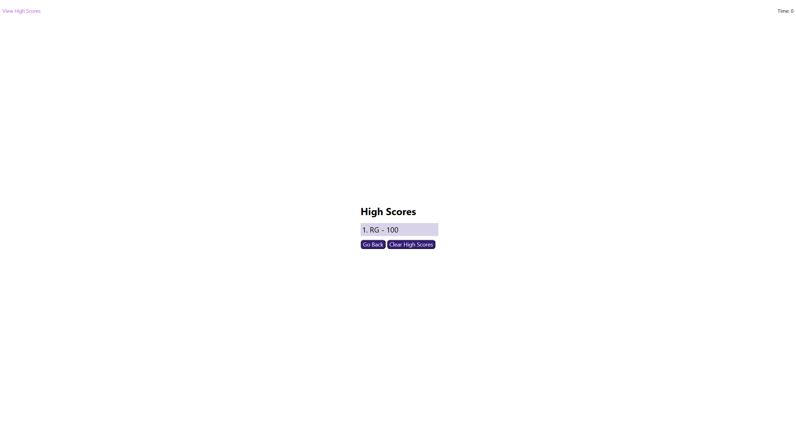

# Code Quiz

## Description
Timed coding quiz of multiple choice questions. The quiz is timed from the moment the first question loads. The game is over either when the user answers all the questions, or the quiz times out. Once the quiz is over, the user can input their initials to save their score. The application will then show the user a list of high scores saved on the browser.

## Screenshots

### Quiz Home

### Start of Quiz

### Results Page

### High Scores List

## Deploy
This project can be visited by clicking on the following link:

https://ricguer.github.io/code-quiz/
